# Screenshots

Preview of every screen of TrustRed Courses, captured from a demo instance
(`DEMO_MODE=true`, generated sample data). Suitable for the README and social
media. Regenerate with `deno task screenshots` (see `scripts/screenshots.ts`).

| Screen                                                                                                                                                      | Description                                                                                                                                                          |
| ----------------------------------------------------------------------------------------------------------------------------------------------------------- | -------------------------------------------------------------------------------------------------------------------------------------------------------------------- |
| [Startseite](./01-home.png) 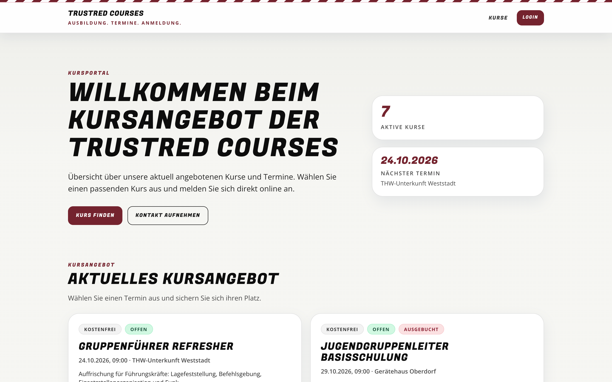                                                                       | Public landing page with hero, key figures and the current course offer. Uppercase display type, brand red and card layout shared with TrustRed CMS.                 |
| [Kursangebot](./02-home-course-cards.png) 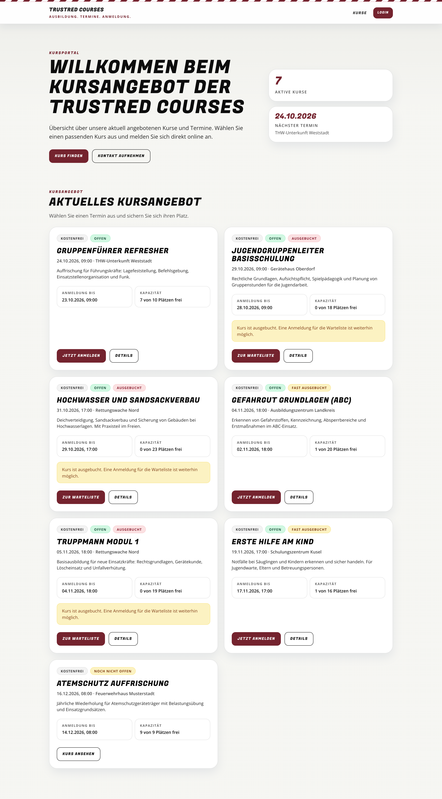                                           | Full course overview: price and status pills, date and location, capacity, waiting-list and sold-out states, direct registration buttons.                            |
| [Kursdetails und Anmeldung](./03-course-detail.png) 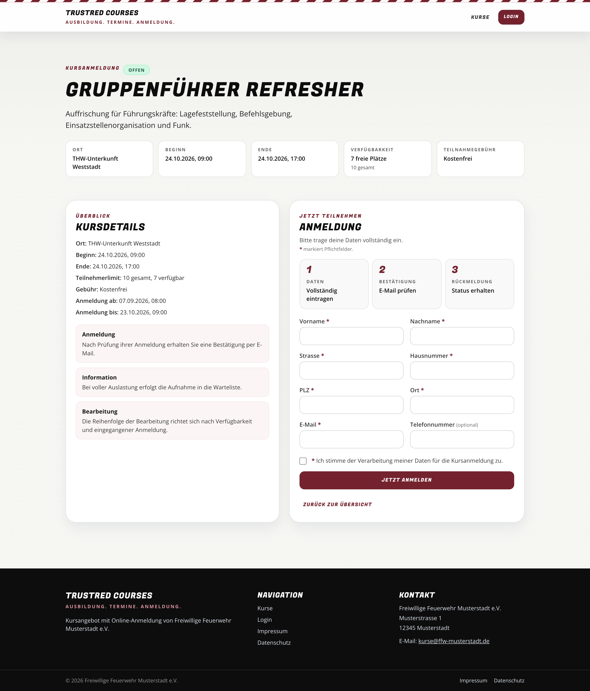                       | Course detail page with facts, three-step explanation and the public registration form with required-field markers and consent checkbox.                             |
| [Ausgebuchter Kurs mit Warteliste](./04-course-waitlist.png) 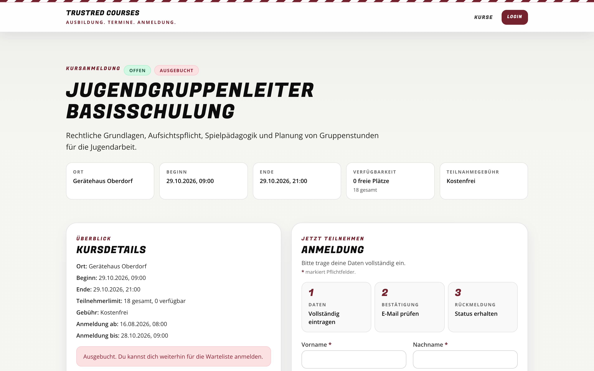     | Sold-out course: the page switches to waiting-list mode with clear status badges and an adjusted call to action.                                                     |
| [Anmeldung bestätigt](./05-registration-confirmed.png) 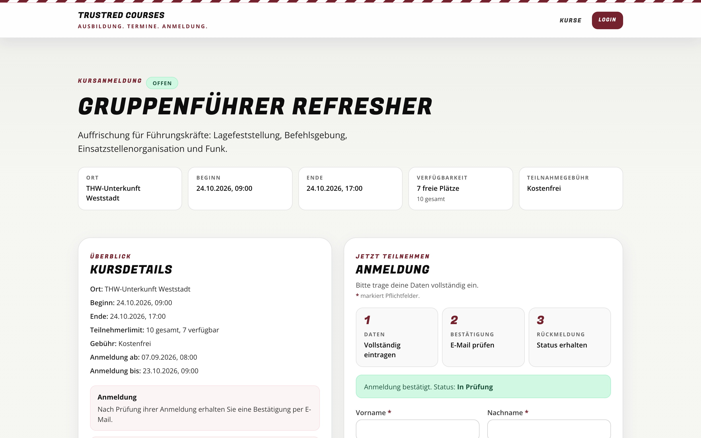                 | After double opt-in the participant sees the confirmation and current status; the admin team is notified.                                                            |
| [Admin-Login](./06-login.png) 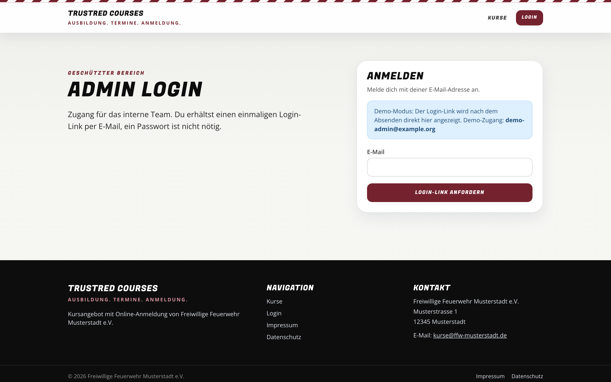                                                                   | Passwordless login for the team: a one-time magic link is sent by e-mail, no passwords to manage.                                                                    |
| [Startseite (Mobil)](./07-mobile-home.png) 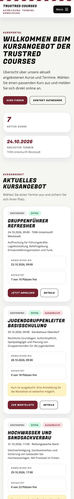                                         | Mobile layout of the landing page with stacked hero, key figures and course cards.                                                                                   |
| [Anmeldung (Mobil)](./08-mobile-course.png) 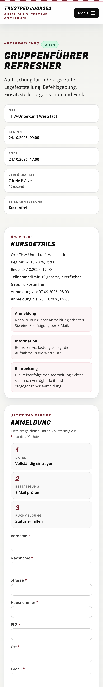                                       | Mobile registration form with large touch targets and single-column facts.                                                                                           |
| [Administration](./10-admin-dashboard.png) 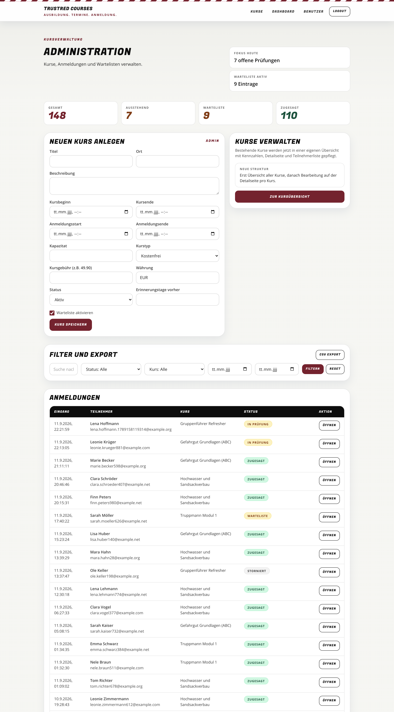                                         | Dashboard with registration statistics, course creation form, filters, CSV export and the registration table.                                                        |
| [Kursverwaltung](./11-admin-courses.png) 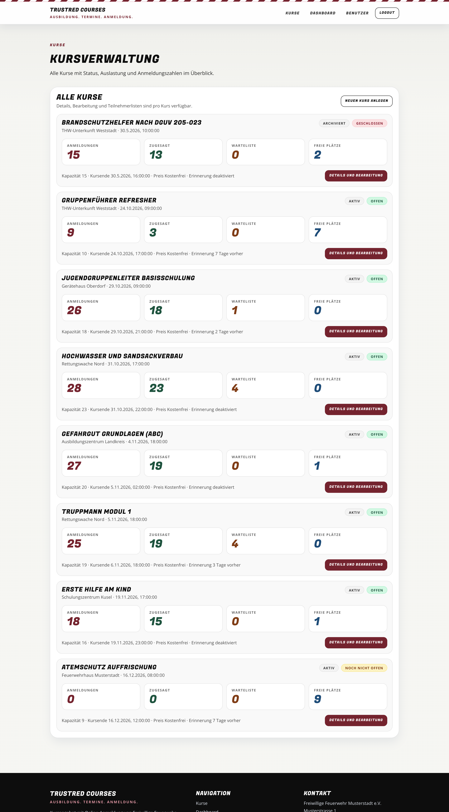                                             | All courses with status, registration window, capacity figures and quick access to details.                                                                          |
| [Kurs bearbeiten und Teilnehmer](./12-admin-course-detail.png) 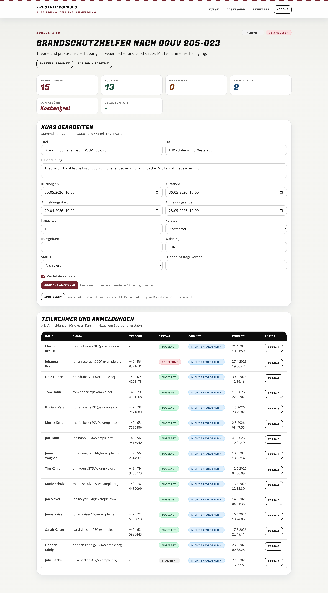 | Course editing (dates, capacity, fee, waiting list, reminders), revenue figures and the participant table with payment status.                                       |
| [Anmeldung bearbeiten](./13-admin-registration.png) 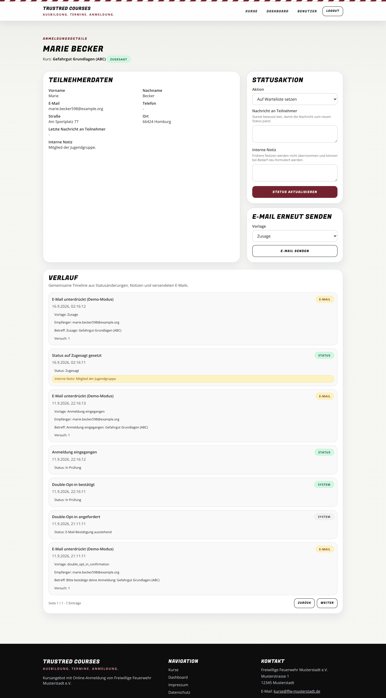                       | Registration detail: participant data, status actions with message to the participant and internal note, e-mail resend, full timeline of status changes and e-mails. |
| [Benutzerverwaltung](./14-admin-users.png) 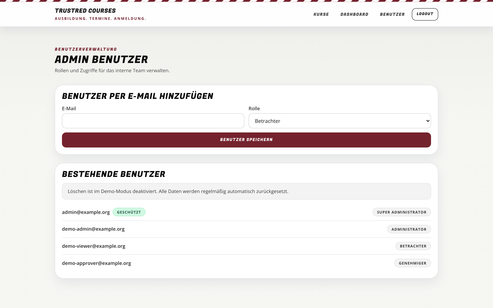                                         | Team accounts with roles (viewer, editor, approver, administrator) managed by e-mail address.                                                                        |
| [Impressum und Datenschutz](./15-legal.png) 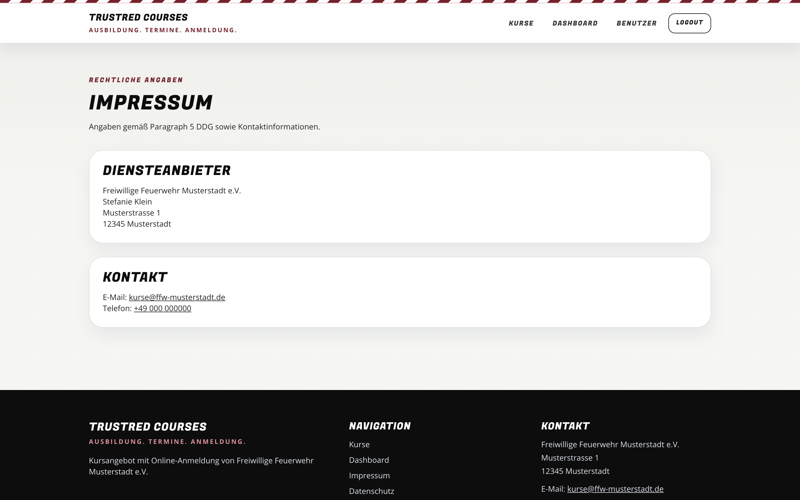                                       | Legal pages are generated from configuration (organisation, representative, contact).                                                                                |
| [Fehlerseite](./16-not-found.png) 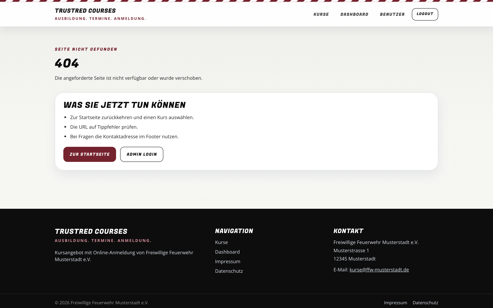                                                           | Friendly 404 page in the same design language.                                                                                                                       |
